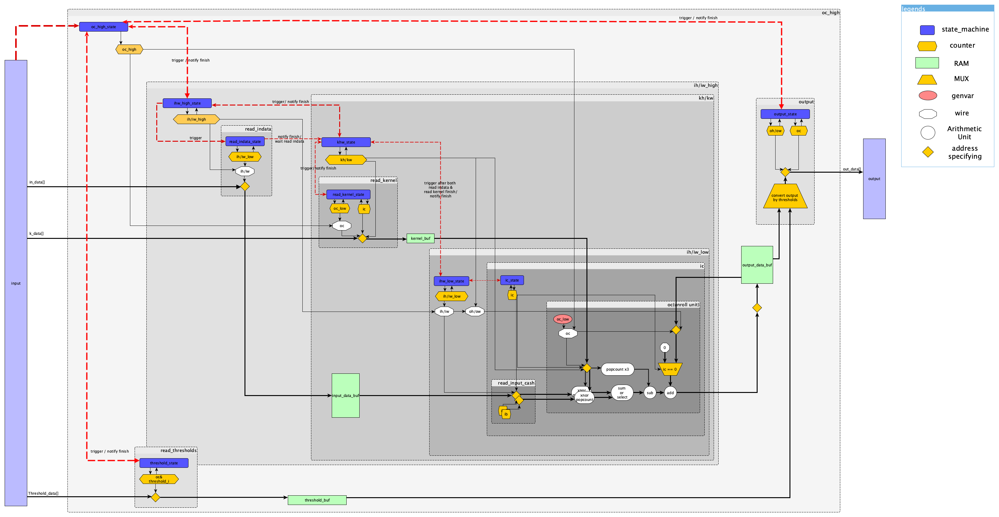

# Design of qconv\_kn2row\_tiling for HDL implementation.

## block diagram

## state machine hierarchie 
- oc\_high\_state
	- ih/iw\_high\_state
		- read\_indata\_state
		- out\_buf\_init\_state
		- kh/kw\_state
			- read\_kernel\_state
			- ih/iw\_low\_state
				- ic_state
					- unroll ib (reading input cash)
					- unroll oc\_low (calculation unroll unit)
	- read\_threshold\_state
	- output\_state	

## sequence flow.
### oc\_high\_state
1. wait until triggered by start signal
2. start the ih/iw\_high\_state\_machine and the read\_threshold\_state\_machine
3. wait until both state machine finish.
4. start output state machine
5. wait until output state machine finishes.
6. if oc\_high == out\_c:
	- then: 
		- reset oc\_high 
		- notify the caller of its finish. 
		- go to state 1.
	- else: increment oc\_high and go to state 2.
	
### ih/iw\_high\_state
1. wait until triggered by oc\_hight\_state machine.
2. start the read\_indata state machine and the out\_buf\_init state machine.
3. wait until both state machine finishes.
4. start kh/kw\_state machine.
5. wait until kh/kw\_state machine finish.
6. if finish:						 #FIXME
	- then:
		- reset ih/iw 
		- notify oc\_high\_state machine of its finish.
		- go to the state 1.
	- else: update ih/iw and go to the state 2.  #FIXME

### read\_indata\_state
1. wait until triggered by ih/iw\_high\_state
2. read all indata #TODO:
	- this step needs to handle AXI or Avalon Bus, so ask Kawazome-san.
3. notify ih/iw\_high\_state machine of its finish and go to the state 1.
 	
### out\_buf\_init\_state
1. wait until triggered by ih/iw\_high\_state
2. init the output_buf. #TODO:
	- the data is hard wired to 0 and enable is handled by outbuf_handller.
	- What to do is to specify the ddress of out_buf. 
3. notify ih/iw\_high\_state machine of its finish and go to the state 1.

### kh/kw\_state
1. wait until triggered by ih/iw\_high\_state
2. start the read\_kernel\_state machine.
3. wait until read\_kernel\_state machine finish.
4. 	start the ih/iw_state machine.
6. if finish: #FIXME
	- then: 
		- reset kh and kw. 
		- notify the kh/kw\_state machine of its finish. 
		- go to state 1.
	- else: update kh/kw and go to state 2.

### read\_kernel\_state
1. wait until triggered by kh/kw\_state
2. read all kernel\_data #TODO:
	- this step needs to handle AXI or Avalon Bus, so ask Kawazome-san.
3. notify kh/kw\_state machine of its finish and go to the state 1.

### ih/iw\_low\_state
1. wait until triggered by kh/kw\_state machine.
2. start the ic state machine.
3. wait until the ic\_state machine finishes.
6. if finish:						 #FIXME
	- then:
		- reset ih/iw\_low 
		- notify kh/kw\_state machine of its finish.
		- go to the state 1.
	- else: update ih/iw\_low and go to the state 2.  #FIXME

### ic_state
1. wait until triggered by ih/iw\_low\_state machine.
2. read_input_cash to registers.
3. start each units.
3. wait until each computation finish.
6. if finish:						 #FIXME
	- then:
		- reset ic 
		- notify ih/iw\_low\_state machine of its finish.
		- go to the state 1.
	- else: update ic and go to the state 2.  #FIXME

### unroll ib (reading input cash)
### unroll oc\_low (calculation unroll unit)
#### resource utilization
- popcount: 3
- xnor: 2
- add(sub): 3
- ×３: 1
- MUX: 1

### read\_threshold\_state
1. wait until triggered by kh/kw\_state
2. read all indata #TODO:
	- this step needs to handle AXI or Avalon Bus, so ask Kawazome-san.
3. notify oc\_high\_state machine of its finish and go to the state 1.

### output\_state	
1. wait until triggered by kh/kw\_state
2. write back all outbuf data #TODO:
	- this step needs to handle AXI or Avalon Bus, so ask Kawazome-san.
3. notify oc\_high\_state machine of its finish and go to the state 1.
	

## RAM

### indata_buf
the memory bank num should be the multiple of 2(ib unroll)
### thresholds_buf
the memory bank num should be the multiple of 4(to compare all threasholds at same time )
### kernel_buf
the memory bank num should be the multiple of output channel unroll.
### outdata_buf
the memory bank num should be the multiple of output channel unroll.

	
## constants

 	