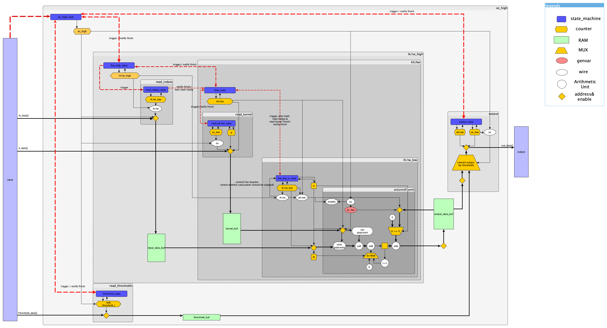
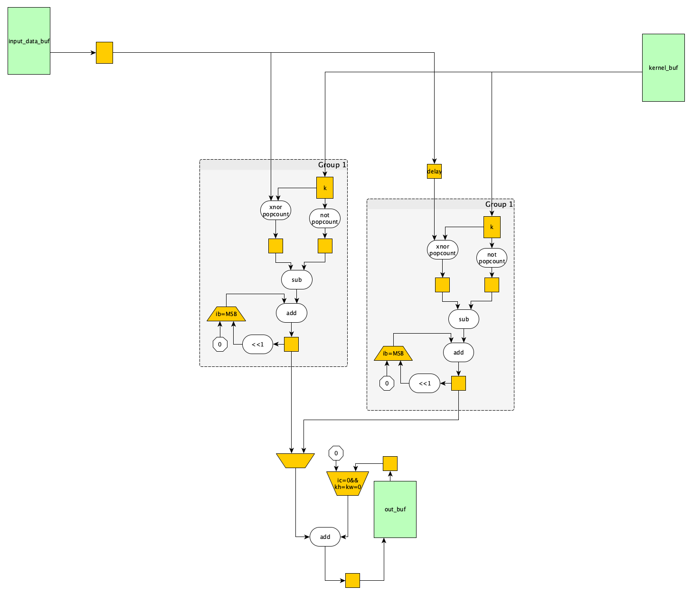
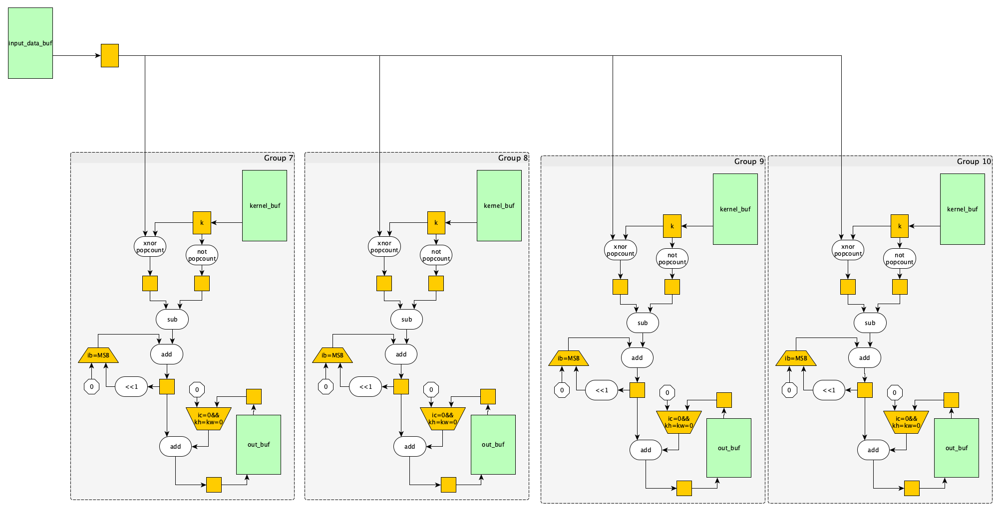

# design overview
## 問題点、改善可能点
- ic=0だけでなく、kw=kh=０をoutbufのマルチプレクサの条件に追加する必要あり。
- icのループに対し、毎回
- control_flow.mdの説明がアップデートできていない。
- icのループが続くうちは、outbufに戻さず、FFでaccしていけば良いのでは？

## 大まかな処理の流れ

## マイクロアーキテクチャ
### calculation unit

there can be several types of units. see[./design/calc_unit_discuss.png]

### unroll
- input channel unroll  

- output channel time unroll  

- output channel area unroll

- all integrated unroll are as follows.(2×2×4)

## timing
[spreadsheet](https://docs.google.com/spreadsheets/d/1vuLFVfZyjgWhiUy8i6Kdp5oRs9EIJO7mR0NpXOelV7Y/edit?usp=sharing)

 	